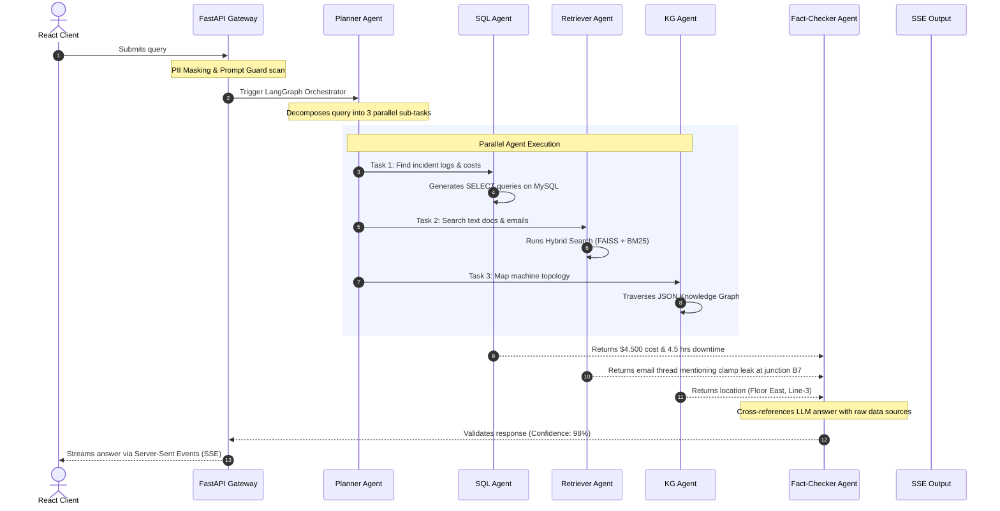

# 🧠 EKOS — AI Enterprise Knowledge Operating System

> A production-grade, multi-agent RAG platform that unifies enterprise data (PDFs, Emails, Excel, SQL, Images, and more) into a single intelligent system powered by 10 specialized AI agents.


---

## 🚀 What Makes This Different

This is **NOT** another RAG chatbot. Instead of asking *"What's in this PDF?"*, users ask:

> **"Why did Machine X fail three times this month?"**

EKOS orchestrates **10 specialized AI agents** to search across documents, query databases, analyze images, traverse knowledge graphs, and verify facts — delivering cited, verified answers.

---

## 🏗️ Architecture

```
┌──────────────────────────────────────────────────┐
│                 REACT FRONTEND                    │
│  Chat │ Documents │ Evaluation │ Admin │ Dashboard│
└──────────────────┬───────────────────────────────┘
                   │ REST API / SSE
┌──────────────────┴───────────────────────────────┐
│              FASTAPI BACKEND                      │
│  ┌────────────────────────────────────────────┐  │
│  │     MULTI-AGENT ORCHESTRATOR (LangGraph)   │  │
│  │  Planner → Retriever → SQL → Vision →      │  │
│  │  Graph → Reasoning → Critic → Fact Check → │  │
│  │  Memory → Report Generator                 │  │
│  └────────────────────────────────────────────┘  │
│  ┌─────────┐ ┌──────┐ ┌────────┐ ┌───────────┐ │
│  │  FAISS  │ │ BM25 │ │Reranker│ │ Knowledge │ │
│  │ (Dense) │ │(Sparse│ │        │ │   Graph   │ │
│  └─────────┘ └──────┘ └────────┘ └───────────┘ │
│  ┌─────────┐ ┌──────────────┐ ┌──────────────┐ │
│  │  MySQL  │ │ File Storage │ │ FAISS Index  │ │
│  └─────────┘ └──────────────┘ └──────────────┘ │
└──────────────────────────────────────────────────┘
```

---

## 🤖 Agent System

| Agent | Role |
|-------|------|
| **Planner** | Decomposes complex queries into sub-tasks |
| **Retriever** | Hybrid RAG (FAISS + BM25 + Reranking) |
| **SQL Agent** | Natural language → SQL query execution |
| **Vision Agent** | Image analysis & OCR |
| **Graph Agent** | Knowledge graph traversal |
| **Memory Agent** | Conversation & long-term memory |
| **Reasoning Agent** | Evidence synthesis |
| **Critic Agent** | Answer quality assessment |
| **Fact Checker** | Claim verification against sources |
| **Report Generator** | Structured response formatting |

---

## 🛠️ Tech Stack (All Free Tier)

| Layer | Technology |
|-------|-----------|
| LLM | Groq Cloud (Llama 3, Mixtral) |
| Embeddings | Google Generative AI (text-embedding-004) |
| Vector Store | FAISS |
| Database | MySQL 8.0 |
| Backend | FastAPI (Python 3.11) |
| Frontend | React 18 |
| Agent Orchestration | LangGraph |
| Evaluation | RAGAS + DeepEval |
| Experiment Tracking | MLflow |
| CI/CD | GitHub Actions |

---

## 📦 Quick Start

### Prerequisites
- Python 3.11+
- Node.js 18+
- MySQL 8.0
- Groq API Key ([free](https://console.groq.com))
- Google AI API Key ([free](https://aistudio.google.com))

### Backend Setup
```bash
cd backend
python -m venv venv
venv\Scripts\activate        # Windows
pip install -r requirements.txt

# Setup MySQL database
mysql -u root -p < scripts/setup_db.sql
mysql -u root -p ekos_db < scripts/seed_data.sql

# Configure environment
copy .env.example .env
# Edit .env with your API keys

# Run
uvicorn app.main:app --reload --port 8000
```

### Frontend Setup
```bash
cd frontend
npm install
npm start
```

### Access
- Frontend: http://localhost:3000
- Backend API: http://localhost:8000
- API Docs: http://localhost:8000/docs

---

## 📊 Evaluation Metrics

| Metric | Framework |
|--------|-----------|
| Answer Relevance | RAGAS |
| Faithfulness | RAGAS |
| Context Precision | RAGAS |
| Context Recall | RAGAS |
| Hallucination Rate | DeepEval |
| Latency | Custom |
| Agent Success Rate | Custom |
| Tool Selection Accuracy | Custom |

## 🔄 Step-by-Step Execution Flow (Scenario)

To understand how EKOS orchestrates its agent network, let's look at the lifecycle of a single user query:

> **User Query:** *"Why did Machine X (MCH-X001) fail in June 2024 and how much did it cost?"*



---

## 🏗️ Detailed Project Pipelines & Workflows

### 1. The Multi-Agent Execution Pipeline (LangGraph Workflow)
The execution of a query follows a strict LangGraph-driven routing process:
1. **Inbound Security and Sanitization**: The request arrives via `POST /api/query`. The backend runs a Prompt Injection detection middleware and a PII mask filter to replace sensitive values (names, addresses) before sending anything to the LLMs.
2. **Long-Term Memory Search**: The `MemoryAgent` pulls recent conversation state and user profiles from the MySQL database to add relevant semantic context.
3. **Structured Plan Generation**: The `PlannerAgent` executes a LLM call to break the user query into component tasks. Each task specifies a target specialist agent (`RETRIEVER`, `SQL_AGENT`, `VISION`, or `GRAPH`) and key instructions.
4. **Conditional Routing Execution**:
   - If both unstructured data and structured metrics are needed, the orchestrator routes to the `RetrieverAgent` first, then the `SQLAgent`.
   - The specialist nodes run their tasks synchronously or in parallel, modifying the shared `AgentState` object.
5. **Synthesis & Reasoning**: The `ReasoningAgent` gathers the output text logs from the vector database, SQL return values, and knowledge graph relations, building a unified response.
6. **Double-Verification Quality Loop**:
   - The `CriticAgent` evaluates the response on relevance, coherence, and accuracy. If the score is below `0.6`, it sends instructions back to the `ReasoningAgent` for a single retry.
   - The `FactCheckerAgent` parses distinct factual claims and maps them to citations in the retrieved text to ensure no hallucinations occurred.
7. **Streaming Output Generator**: The `ReportGeneratorAgent` reformats the output into structured plaintext, removes markdown headers/bold signs, appends a dedicated "EVALUATION METRICS" footer, and streams the result to the React UI using Server-Sent Events (SSE).

---

### 2. The Knowledge Graph Pipeline
The Knowledge Graph in EKOS tracks the physical topology, human operators, and component relationships of the factory floor.

#### Technology Stack & Frameworks
* **NetworkX (version 3.4.2)**: Used as the core Python library to build and navigate directed graphs (`nx.DiGraph`).
* **NumPy (version 1.26.4)**: Used for fast matrix computations, statistical metrics, and node/edge type distributions.
* **JSON File Storage**: The graph is loaded/persisted as a local file (`backend/knowledge_graph.json`).

#### Entity Relationship Schema
The knowledge graph uses node schemas for:
* **Machines**: e.g., `MCH-X001` (properties: name, location)
* **Production Lines**: e.g., `Line-3` (properties: area)
* **Technicians**: e.g., `Carlos Rodriguez` (properties: specialization)
* **Parts**: e.g., `SKF-7210` (properties: type, part name)

It implements 10 edge relationship types to connect these nodes:
* `part_of` (e.g., machine is part of a production line)
* `maintained_by` (e.g., machine is repaired by a technician)
* `uses_part` (e.g., machine is configured with a specific part)
* `caused_by`, `reported_by`, `resolved_by`, `located_in`, `depends_on`, `similar_to`, `related_to`.

#### Execution Workflow in the Pipeline
1. **Activation**: When the `PlannerAgent` identifies queries referring to parts, locations, maintenance personnel, or dependency relationships, it schedules a `GRAPH` agent sub-task.
2. **Entity Term Extraction**: The `GraphAgent` extracts terms from the sub-task description (e.g., machine IDs or part names).
3. **Subgraph Traversal (BFS)**: It searches the `KnowledgeGraph` singleton for matching nodes, then performs a Breadth-First Search (BFS) traversal up to `depth=1` to extract neighboring entities.
4. **Context Synthesis**: Relationships are serialized (e.g. `MCH-X001 --[uses_part]--> SKF-7210 (bearing)`) and output as `graph_summary`. This string is fed to the reasoning agent to explain mechanical chains-of-failure. The backend also exports the visual subgraph node-link structure to render interactive D3.js topology maps on the React frontend.

---

### 3. Ingestion & Retrieval Synchronization Pipeline
To search documents reliably, EKOS runs a dual-engine (dense + sparse) synchronization pipeline:
1. **Document Upload**: Raw files (PDFs, Word, Excel, Email threads) are uploaded through the FastAPI `/api/documents/upload` endpoint.
2. **Text Extraction**: The ingestion pipeline parses text dynamically using specialized library hooks:
   - **PyMuPDF (`fitz`)**: For multi-page PDF documents.
   - **python-docx**: For Word files.
   - **openpyxl / pandas**: For Excel spreadsheets.
   - **Pillow & Tesseract OCR**: For image files and scans.
3. **Recursive Chunking**: Extracted text is split into chunks of `512` characters with `50` characters of overlap to preserve boundaries.
4. **Vector Embedding (Dense)**: Each chunk is embedded using Google's `models/text-embedding-004` API to produce a 768-dimensional vector, which is uploaded to **Pinecone Cloud** via LangChain's `PineconeVectorStore` wrapper.
5. **Metadata Sync (Firestore)**: File path, ingestion status, size, and page numbers are saved to Cloud Firestore for tracking. A backup copy of vector metadata is also stored in Firestore under a unified cache collection.
6. **BM25 Sync (Sparse)**: When search queries execute, the `SparseRetriever` checks the local metadata cache. If new documents have been added, it synchronizes the `rank-bm25` index on the fly.
7. **Hybrid Retrieval with RRF**:
   - **Dense Search**: Retrieves the top `k` chunks by cosine similarity from the **Pinecone Cloud** index.
   - **Sparse Search**: Retrieves the top `k` chunks using local BM25 keyword matching.
   - **RRF (Reciprocal Rank Fusion)**: Scores are merged using an RRF algorithm, and a cross-encoder model (`cross-encoder/ms-marco-MiniLM-L-6-v2`) reranks the outputs to deliver the top 5 most relevant passages to the LLM.

---

## 📁 Project Structure

```
enterprise-knowledge-os/
├── backend/
│   ├── app/
│   │   ├── agents/          # 10 AI agents + orchestrator
│   │   ├── api/             # FastAPI routes & middleware
│   │   ├── db/              # Database, vector store, knowledge graph
│   │   ├── evaluation/      # RAGAS, DeepEval, MLflow
│   │   ├── ingestion/       # Document parsing & embedding pipeline
│   │   ├── llm/             # Groq client & prompt management
│   │   ├── rag/             # Hybrid retrieval pipeline
│   │   ├── security/        # Auth, RBAC, PII masking
│   │   └── utils/           # Logging & exceptions
│   ├── prompts/             # Agent prompt templates (YAML)
│   ├── scripts/             # DB setup & seed scripts
│   ├── tests/               # Pytest test suite
│   └── data/                # Sample enterprise documents
├── frontend/
│   └── src/
│       ├── components/      # Reusable UI components
│       ├── pages/           # App pages
│       ├── services/        # API integration
│       ├── context/         # React context providers
│       └── hooks/           # Custom React hooks
└── .github/workflows/       # CI/CD pipelines
```

---

## 🔒 Security Features
- JWT authentication with refresh tokens
- Role-based access control (Admin, Analyst, Viewer)
- PII masking before LLM calls
- Prompt injection detection
- Rate limiting
- Audit logging

---

## 📜 License
MIT
