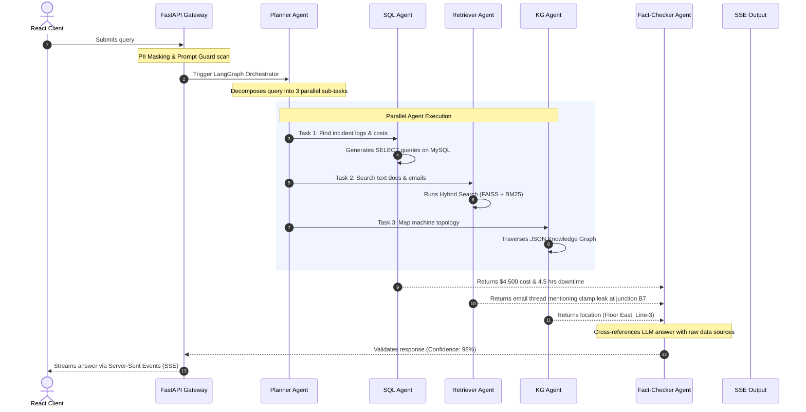

# 🧠 EKOS — AI Enterprise Knowledge Operating System

> A production-grade, multi-agent RAG platform that unifies enterprise data (PDFs, Emails, Excel, SQL, Images, and more) into a single intelligent system powered by 10 specialized AI agents.


---

## 🚀 What Makes This Different

This is **NOT** another RAG chatbot. Instead of asking *"What's in this PDF?"*, users ask:

> **"Why did Machine X fail three times this month?"**

EKOS orchestrates **10 specialized AI agents** to search across documents, query databases, analyze images, traverse knowledge graphs, and verify facts — delivering cited, verified answers.

---

## 🏗️ Architecture

```
┌──────────────────────────────────────────────────┐
│                 REACT FRONTEND                    │
│  Chat │ Documents │ Evaluation │ Admin │ Dashboard│
└──────────────────┬───────────────────────────────┘
                   │ REST API / SSE
┌──────────────────┴───────────────────────────────┐
│              FASTAPI BACKEND                      │
│  ┌────────────────────────────────────────────┐  │
│  │     MULTI-AGENT ORCHESTRATOR (LangGraph)   │  │
│  │  Planner → Retriever → SQL → Vision →      │  │
│  │  Graph → Reasoning → Critic → Fact Check → │  │
│  │  Memory → Report Generator                 │  │
│  └────────────────────────────────────────────┘  │
│  ┌─────────┐ ┌──────┐ ┌────────┐ ┌───────────┐ │
│  │  FAISS  │ │ BM25 │ │Reranker│ │ Knowledge │ │
│  │ (Dense) │ │(Sparse│ │        │ │   Graph   │ │
│  └─────────┘ └──────┘ └────────┘ └───────────┘ │
│  ┌─────────┐ ┌──────────────┐ ┌──────────────┐ │
│  │  MySQL  │ │ File Storage │ │ FAISS Index  │ │
│  └─────────┘ └──────────────┘ └──────────────┘ │
└──────────────────────────────────────────────────┘
```

---

## 🤖 Agent System

| Agent | Role |
|-------|------|
| **Planner** | Decomposes complex queries into sub-tasks |
| **Retriever** | Hybrid RAG (FAISS + BM25 + Reranking) |
| **SQL Agent** | Natural language → SQL query execution |
| **Vision Agent** | Image analysis & OCR |
| **Graph Agent** | Knowledge graph traversal |
| **Memory Agent** | Conversation & long-term memory |
| **Reasoning Agent** | Evidence synthesis |
| **Critic Agent** | Answer quality assessment |
| **Fact Checker** | Claim verification against sources |
| **Report Generator** | Structured response formatting |

---

## 🛠️ Tech Stack (All Free Tier)

| Layer | Technology |
|-------|-----------|
| LLM | Groq Cloud (Llama 3, Mixtral) |
| Embeddings | Google Generative AI (text-embedding-004) |
| Vector Store | FAISS |
| Database | MySQL 8.0 |
| Backend | FastAPI (Python 3.11) |
| Frontend | React 18 |
| Agent Orchestration | LangGraph |
| Evaluation | RAGAS + DeepEval |
| Experiment Tracking | MLflow |
| CI/CD | GitHub Actions |

---

## 🚀 End-to-End Setup & Deployment Guide

Follow this detailed procedure to get the entire EKOS platform running on your local machine or server.

### Phase 1: Prerequisites & Repository Setup
1. **Clone the Repository**:
   ```bash
   git clone https://github.com/your-username/enterprise-knowledge-os.git
   cd enterprise-knowledge-os
   ```
2. **Install Required Software**:
   - [Docker Desktop](https://www.docker.com/products/docker-desktop/) (Required for containerized deployment)
   - Python 3.11+ (If running backend locally)
   - Node.js v22+ (If running frontend locally)
3. **Acquire API Keys (All Free Tier)**:
   - **Groq API Key**: Create an account at [console.groq.com](https://console.groq.com) and generate an API key.
   - **Google AI Studio Key**: Go to [aistudio.google.com](https://aistudio.google.com) and generate an API key for the text-embedding models.

### Phase 2: Environment Configuration
1. Navigate to the `backend` directory:
   ```bash
   cd backend
   ```
2. Copy the example environment file to create your local `.env`:
   ```bash
   cp .env.example .env
   ```
3. Open the `.env` file in your editor and configure the following required fields:
   ```env
   GROQ_API_KEY=your_groq_api_key_here
   GOOGLE_API_KEY=your_google_api_key_here
   
   # Note: The system requires a highly capable model for evaluation parsing.
   # We default to llama-3.3-70b-versatile to avoid rate-limiting and parsing errors.
   GROQ_MODEL_LARGE=llama-3.3-70b-versatile
   GROQ_MODEL_SMALL=llama-3.1-8b-instant
   ```

### Phase 3: Deployment Options

#### Option A: One-Click Docker Deployment (Recommended)
This is the fastest way to get the entire stack (MySQL, FastAPI Backend, React Frontend) running.

1. From the **root** of the project directory, run:
   ```bash
   docker-compose up --build -d
   ```
2. **What happens during this step?**
   - **MySQL Database (`db`)**: Spins up, creates `ekos_db`, and automatically runs the `.sql` scripts inside `backend/scripts/` to create the schemas and seed the initial knowledge graph and user data.
   - **FastAPI Backend (`backend`)**: Installs Python dependencies, waits for the database to be healthy, and starts the API on port `8000`.
   - **React Frontend (`frontend`)**: Builds the React app and serves it via Nginx on port `3000`.
3. Check the logs to ensure everything started successfully:
   ```bash
   docker-compose logs -f
   ```

#### Option B: Local Bare-Metal Development (For active coding)
If you prefer to run the servers directly on your machine for debugging:

**1. Start the Database**
- Install MySQL 8.0 locally, or spin up just the database container:
  ```bash
  docker-compose up db -d
  ```

**2. Start the Backend (FastAPI)**
```bash
cd backend
python -m venv venv
source venv/bin/activate  # On Windows: venv\Scripts\activate
pip install -r requirements.txt
uvicorn app.main:app --reload --host 0.0.0.0 --port 8000
```
- The API will be available at `http://localhost:8000/docs`

**3. Start the Frontend (React)**
```bash
cd frontend
npm install
npm run start
```
- The UI will be available at `http://localhost:3000`

### Phase 4: Accessing the System & Running Queries
Once the system is up and running (via Docker or locally):

1. **Open the Dashboard**: Navigate to [http://localhost:3000](http://localhost:3000) in your browser.
2. **Log In**: Use the default seeded admin credentials (or create a new user).
3. **Upload Documents**: Go to the Knowledge Base section and upload sample PDFs or text files. The backend will automatically parse, embed, and store them in the FAISS vector index.
4. **Run a Query**: Go to the Chat interface and ask a complex question (e.g., *"Why did the shuttle table fail?"*).
5. **View Agent Traces**: You will see the LangGraph orchestrator kick off parallel agents (Retriever, SQL, Graph) and stream the final reasoned answer back to the UI, alongside RAGAS evaluation scores!

### Phase 5: Shutting Down
To gracefully stop the Docker containers while preserving your database volumes:
```bash
docker-compose down
```
If you wish to completely wipe the database and start fresh next time:
```bash
docker-compose down -v
```

---

## 📊 Evaluation Metrics

| Metric | Framework |
|--------|-----------|
| Answer Relevance | RAGAS |
| Faithfulness | RAGAS |
| Context Precision | RAGAS |
| Context Recall | RAGAS |
| Hallucination Rate | DeepEval |
| Latency | Custom |
| Agent Success Rate | Custom |
| Tool Selection Accuracy | Custom |

## 🔄 Step-by-Step Execution Flow (Scenario)

To understand how EKOS orchestrates its agent network, let's look at the lifecycle of a single user query:

> **User Query:** *"Why did Machine X (MCH-X001) fail in June 2024 and how much did it cost?"*



## 🏗️ Detailed Project Pipelines & Workflows

EKOS is driven by several robust, end-to-end pipelines working concurrently to maintain system state, ingest knowledge, orchestrate agents, evaluate outputs, and automate deployments.

### 1. The Multi-Agent Execution Pipeline (LangGraph Workflow)
The execution of a query follows a strict LangGraph-driven routing process:
1. **Inbound Security and Sanitization**: The request arrives via `POST /api/query`. The backend runs a Prompt Injection detection middleware and a PII mask filter to replace sensitive values (names, addresses) before sending anything to the LLMs.
2. **Long-Term Memory Search**: The `MemoryAgent` pulls recent conversation state and user profiles from the MySQL database to add relevant semantic context.
3. **Structured Plan Generation**: The `PlannerAgent` executes an LLM call to break the user query into component tasks. Each task specifies a target specialist agent (`RETRIEVER`, `SQL_AGENT`, `VISION`, or `GRAPH`) and key instructions.
4. **Conditional Routing Execution**:
   - If both unstructured data and structured metrics are needed, the orchestrator routes to the `RetrieverAgent` first, then the `SQLAgent`.
   - The specialist nodes run their tasks synchronously or in parallel, modifying the shared `AgentState` object.
5. **Synthesis & Reasoning**: The `ReasoningAgent` gathers the output text logs from the vector database, SQL return values, and knowledge graph relations, building a unified response.
6. **Double-Verification Quality Loop**:
   - The `CriticAgent` evaluates the response on relevance, coherence, and accuracy. If the score is below `0.6`, it sends instructions back to the `ReasoningAgent` for a single retry.
   - The `FactCheckerAgent` parses distinct factual claims and maps them to citations in the retrieved text to ensure no hallucinations occurred.
7. **Streaming Output Generator**: The `ReportGeneratorAgent` reformats the output into structured plaintext, removes markdown headers/bold signs, appends a dedicated "EVALUATION METRICS" footer, and streams the result to the React UI using Server-Sent Events (SSE).

---

### 2. The Knowledge Graph Pipeline
The Knowledge Graph in EKOS tracks the physical topology, human operators, and component relationships of the factory floor.
1. **Entity & Schema Definition**: Uses node schemas for Machines, Lines, Technicians, and Parts; with 10 edge relationship types (e.g., `part_of`, `maintained_by`).
2. **Activation**: When the `PlannerAgent` identifies queries referring to parts, locations, maintenance personnel, or dependency relationships, it schedules a `GRAPH` agent sub-task.
3. **Entity Term Extraction & Subgraph Traversal**: The `GraphAgent` extracts terms from the sub-task description, searches the `KnowledgeGraph` singleton (via NetworkX), and performs a Breadth-First Search (BFS) to extract neighboring entities.
4. **Context Synthesis**: Relationships are serialized and output as `graph_summary`. This is fed to the reasoning agent to explain mechanical chains-of-failure. The backend also exports the visual subgraph node-link structure to render interactive D3.js topology maps on the React frontend.

---

### 3. Ingestion & Retrieval Synchronization Pipeline (Hybrid RAG)
To search documents reliably, EKOS runs a dual-engine (dense + sparse) synchronization pipeline:
1. **Document Upload**: Raw files (PDFs, Word, Excel, Email threads) are uploaded through the FastAPI `/api/documents/upload` endpoint.
2. **Dynamic Text Extraction**: Uses specialized library hooks: `PyMuPDF` for PDFs, `python-docx` for Word, `pandas` for Excel, and `Tesseract OCR` for image scans.
3. **Recursive Chunking & Dense Embedding**: Extracted text is split into overlapping chunks and embedded using Google's `models/text-embedding-004` API to produce 768-dimensional vectors stored in a FAISS index.
4. **Sparse Indexing & Metadata Sync**: When search queries execute, the `SparseRetriever` checks local metadata caches and updates the `rank-bm25` index on the fly.
5. **Hybrid Retrieval with RRF**: Merges FAISS (Dense) and BM25 (Sparse) retrieval via Reciprocal Rank Fusion (RRF), followed by a cross-encoder model reranking to isolate the top 5 most relevant passages.

---

### 4. Evaluation & Telemetry Pipeline (RAGAS + DeepEval)
To ensure production reliability, every generated response goes through an evaluation pipeline:
1. **Metric Computation**: After a response is streamed to the user, background tasks trigger RAGAS and DeepEval to compute:
   - *Faithfulness* (Did the response hallucinate beyond retrieved context?)
   - *Answer Relevance* (Did it actually answer the user's question?)
   - *Context Precision/Recall* (Were the retrieved chunks high quality?)
2. **Experiment Tracking via MLflow**: Computed scores, along with LLM hyper-parameters (temperature, model name), latency metrics, and total token usage, are bundled and sent to an MLflow Tracking Server (`http://localhost:5000`).
3. **Continuous Monitoring**: Admins can view these metrics in the EKOS Admin Dashboard to identify degrading retrieval quality or poor model configurations over time.

---

### 5. CI/CD Pipeline (GitHub Actions)
The project leverages automated Continuous Integration and Continuous Deployment pipelines defined in `.github/workflows`:
1. **Backend CI (`backend-ci.yml`)**: On every push to `main` or pull request, a GitHub Action spins up a Python 3.11 runner, installs dependencies, lints the codebase with `ruff`, and executes the Pytest test suite, ensuring no breaking changes to the FastAPI routes or agent logic.
2. **Frontend CI (`frontend-ci.yml`)**: A separate workflow triggers for frontend changes, utilizing a Node.js runner to install dependencies and run a production build (`npm run build`) to catch compilation errors, linting issues, or breaking React component changes.

---

## 📁 Project Structure

```
enterprise-knowledge-os/
├── backend/
│   ├── app/
│   │   ├── agents/          # 10 AI agents + orchestrator
│   │   ├── api/             # FastAPI routes & middleware
│   │   ├── db/              # Database, vector store, knowledge graph
│   │   ├── evaluation/      # RAGAS, DeepEval, MLflow
│   │   ├── ingestion/       # Document parsing & embedding pipeline
│   │   ├── llm/             # Groq client & prompt management
│   │   ├── rag/             # Hybrid retrieval pipeline
│   │   ├── security/        # Auth, RBAC, PII masking
│   │   └── utils/           # Logging & exceptions
│   ├── prompts/             # Agent prompt templates (YAML)
│   ├── scripts/             # DB setup & seed scripts
│   ├── tests/               # Pytest test suite
│   └── data/                # Sample enterprise documents
├── frontend/
│   └── src/
│       ├── components/      # Reusable UI components
│       ├── pages/           # App pages
│       ├── services/        # API integration
│       ├── context/         # React context providers
│       └── hooks/           # Custom React hooks
└── .github/workflows/       # CI/CD pipelines
```

---

## 🔒 Security Features
- JWT authentication with refresh tokens
- Role-based access control (Admin, Analyst, Viewer)
- PII masking before LLM calls
- Prompt injection detection
- Rate limiting
- Audit logging

---

## 📜 License
MIT
